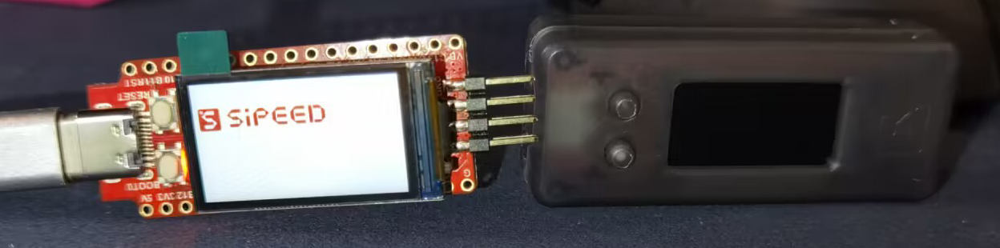
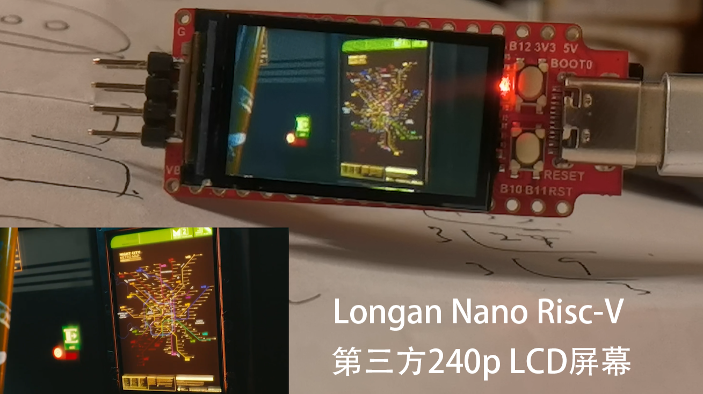
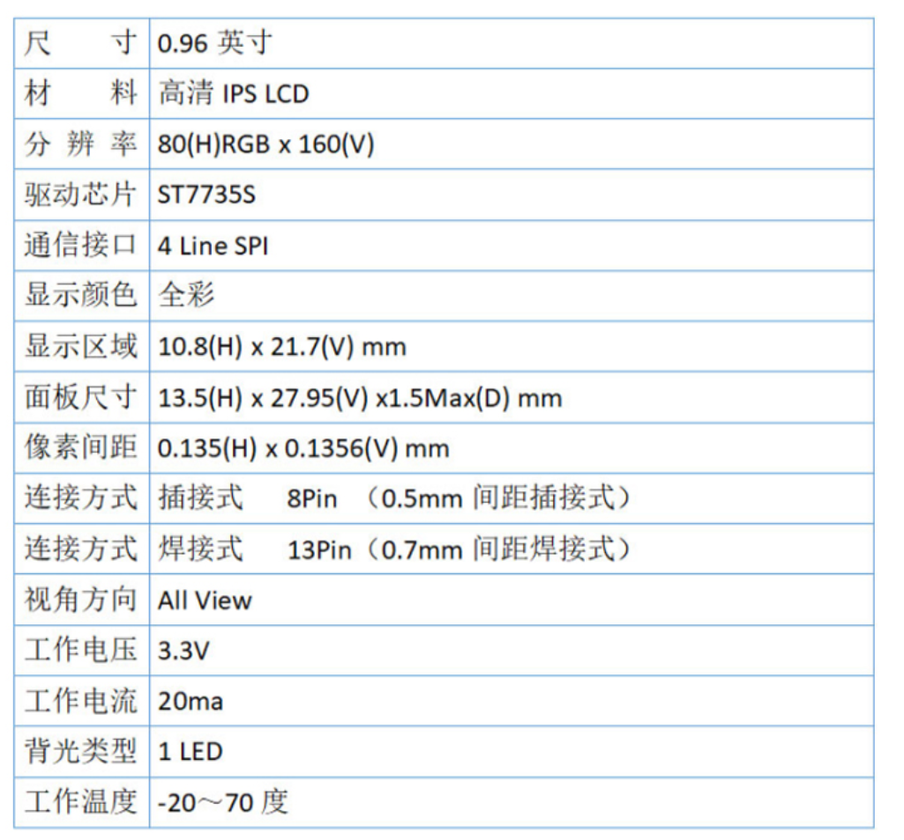
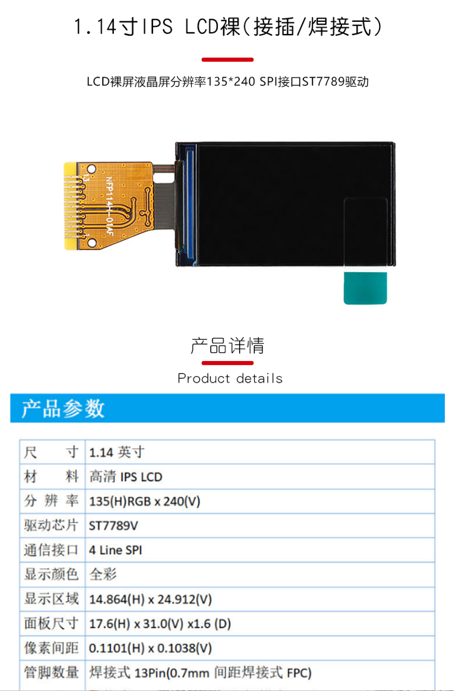

# Longan Nano ST7789LCD

 Testing with new larger LCD

## 进度

* [X] 点亮
* [X] 文字
* [X] 图片
* [X] ~~BadApple~~ [2077](https://www.bilibili.com/video/BV1UK411r7nc/ "已上传Bilibili")
* [X] 支持旋转
* [X] 完全兼容原本函数
* [ ] 外壳

> 2077分成了三部分来刷新，实测一秒大概5张，所以按照原来的100ms/per的的话相当于0.5x播放。
>
> 旋转后组件的位置可能存在细微的误差，没有完全测试，目测没啥问题
>
> 外壳因为官方没有提供新版Longan的文件，于是咕，顺便我也没学犀牛
>
> 请在熟悉[官方BadApple示例](https://longan.sipeed.com/zh/examples/badapple.html "官方Demo")后再食用本项目
>
> 演示视频 [https://www.bilibili.com/video/BV1UK411r7nc/](https://www.bilibili.com/video/BV1UK411r7nc/)

## 屏幕相关信息

*下列资料截取自优X电子，店铺未给广告费，SIPEED目测是中X园电子的屏幕v*

原装是ST7735S驱动的0.96寸 80*160，8pin插接4线SPI屏幕

*0.96寸彩色TFT显示屏高清IPS LCD裸屏液晶屏分辨率80***160 SPI接口*

后来看到一样定义的ST7789V，1.14寸 135*240分辨率屏幕，就打算试试手了v

*1.14寸彩色TFT显示屏高清IPS LCD液晶裸屏分辨率135*240 SPI接口*

